#静态库的制作过程

####制作视频地址
百度网盘

http://pan.baidu.com/disk/home#list/path=%2Fmy_video%2F轩哥Video%2F轩哥的随堂视频%2F静态库的制作

* [制作静态库视频地址](http://pan.baidu.com/disk/home#list/path=%2Fmy_video%2F轩哥Video%2F轩哥的随堂视频%2F静态库的制作)

* [优酷视频地址](http://list.youku.com/albumlist/show?id=27006037&ascending=1&page=1)

####需要掌握以下几点
* 1、静态库的作用是什么
* 2、什么是静态库
* 3、怎么制作静态库
* 4、怎么使用静态库


####简介(1.静态库作用2.什么是静态库)
```
在企业开发中，一些核心技术或者常用框架，出于安全性和稳定性的考虑，不想被外界知道，所以会把核心代码打包成静态库，只暴露头文件给程序员使用（比如：友盟、百度地图等第三方的sdk）

静态库和动态库的存在形式

静态库：.a 和 .framework
动态库：.dylib 和 .framework

静态库和动态库的区别

静态库：链接时，静态库会被完整地复制到可执行文件中，被多次使用就有多份冗余拷贝
动态库：链接时不复制，程序运行时由系统动态加载到内存，供程序调用，系统只加载一次，多个程序共用，节省内存

注意:项目中如果使用了动态库，会苹果拒接

静态库文件的版本（4种）

真机-Debug版本
真机-Release版本
模拟器-Debug版本
模拟器-Release版本

Debug(调试)版本

含完整的符号信息，以方便调试
不会对代码进行优化

Release(发布)版本

不会包含完整的符号信息
的执行代码是进行过优化的
的大小会比Debug版本的略小
在执行速度方面，Release版本会更快些（但不意味着会有显著的提升）

所以我们一般开发中都打包Release（发布）版本，提供外界

设备的CPU架构简介（补充知识）

模拟器：

4s~5 : i386
5s~6plus : x86_64

真机：

3gs~4s : armv7
5~5c : armv7s （静态库只要支持了armv7，就可以跑在armv7s的架构上）
5s~6plus : arm64

```

####制作.a静态库 - Debug版

1.新建项目

2.添加静态库并命名

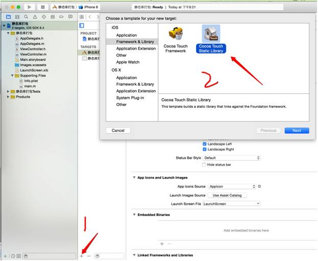
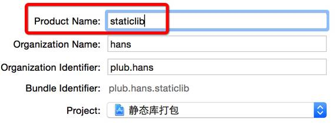

3.需要打包到进静态库的代码，放在这个文件夹内

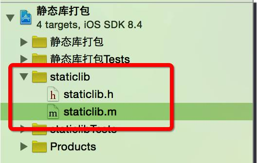

4.重新创建测试类（HSCalculate），提供外界计算两个数和的方法

HSCalculate.h

```
@interface HSCalculate : NSObject
+ (NSInteger)sumNum1:(NSInteger)num1 num2:(NSInteger)num2;
@end

```

HSCalculate.m

```
#import "HSCalculate.h"
@implementation HSCalculate
+ (NSInteger)sumWithNum1:(NSInteger)num1 num2:(NSInteger)num2
{
return num1 + num2;
}
@end

```


5.需要暴露给外界的文件（接口）

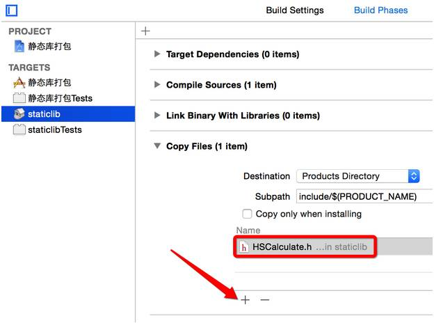

6.打包支持模拟器和真机的静态库（分别选择真机和模拟器运行，就会生成对应的静态库）

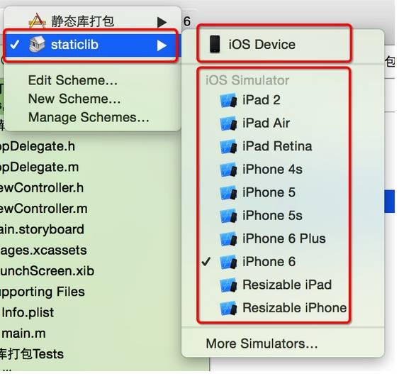

7.查看打包好的静态库

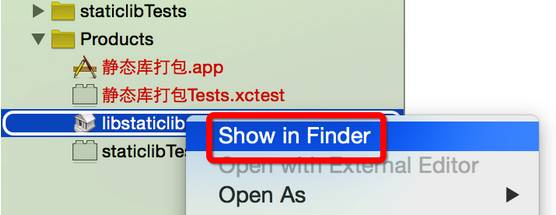


两个文件夹，里面的.a文件就是打包好的静态库

Debug-iphoneos ： 真机
Debug-iphonesimulator：模拟器

可用下面命令查看静态库支持的cpu架构（可查看上面描述的cpu架构类型）

lipo -info xxx.a

分别查看打包好的模拟器与真机的静态库所支持的cpu架构

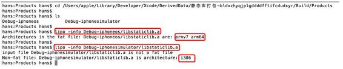

你会发现模拟器的静态库少了4s~5 : i386架构


原因：

下面Debug：Yes表示只编译选中模拟器对应的架构，No则为编译所有模拟器支持的cup架构（Debug的Yes状态改为No即可）

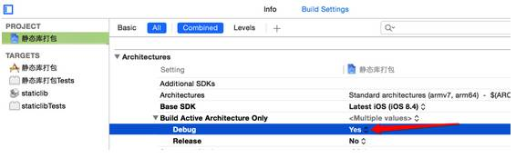

修改完后，重新编译：

8.在本项目对该静态库进行调试，ViewController.m导入HSCalculate.h，测试运行，你会发现报错了

```
#import "ViewController.h"
#import "HSCalculate.h"
@interface ViewController ()
@end
@implementation ViewController
- (void)viewDidLoad {
[super viewDidLoad];
NSInteger result = [HSCalculate sumWithNum1:23 num2:25];
NSLog(@"result: %d", result);
}
@end

```

报错：


原因：

需要导入静态库（编译即可运行成功）

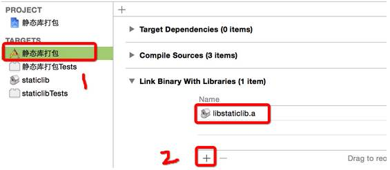

9.同时支持真机与模拟器的静态库（需要合并）

真机和模拟器的静态库，是不一样的，不能同时适用在真机和模拟器上，但要满足这要求的话，要对编译好的两个静态库进行合并

合并好坏：

好：开发过程中既可以在真机上调试，也可以在模拟器上调试
坏：如果静态库太大，合并打包后，会非常大，因此很多第三方的静态库的.a是区分版本的

合并产生新的静态库：

lipo -create Debug-iphoneos/xxx.a Debug-iphonesimulator/xxx.a -output xxx.a

10.把合并好的静态库和外界访问的文件拉入到新工程，即可使用（inc文件自己建立的）

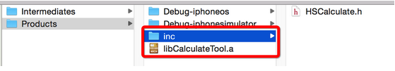

新建工程测试：

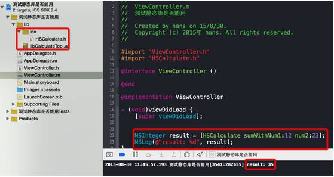

制作静态库 - Release版

跟Debug版步骤一样，只不过在编译时，改下面的选项即可

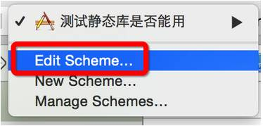
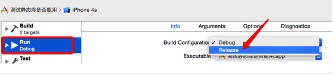

制作静态库 - .framework版

步骤跟制作.a静态库，基本一致，但要注意的下面几点：

1.选择framework

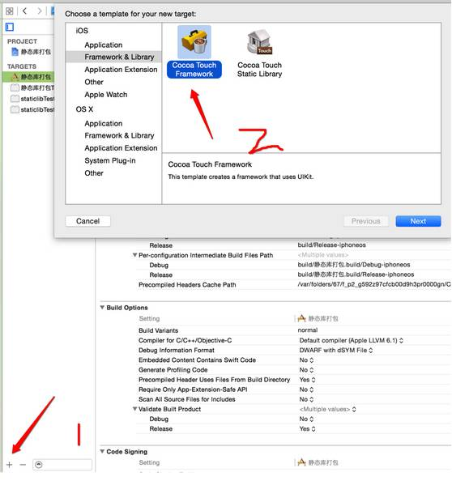

2.编译时，默认制作成动态库，要在下面选择

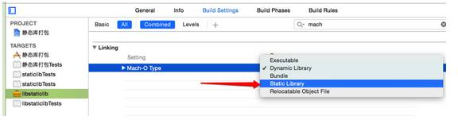

3.合并静态库时，是选.framework文件里的libstaticlib文件

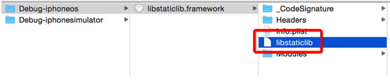

合并：

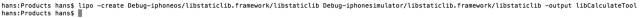

删除libstaticlib，libCalculateTool拉入libstaticlib.framework项目中，libstaticlib.framework静态库制作完成

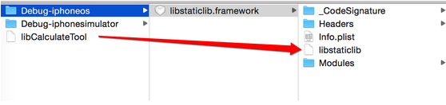
